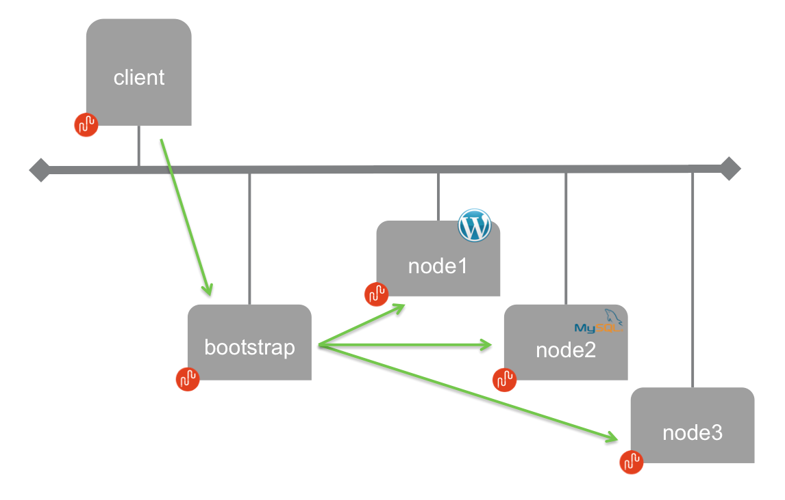
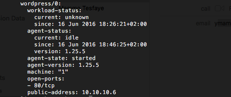
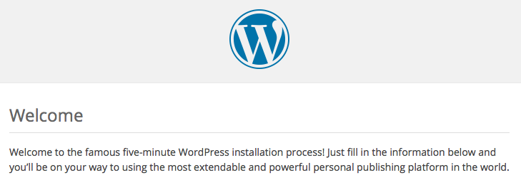

# Juju cluster, with one client, one bootstrap, and three nodes

The objective of this use case is to deploy a cluster with Juju at the [Managed Cloud Platform from Dimension Data](http://cloud.dimensiondata.com/eu/en/).
This is done with [plumbery](https://developer.dimensiondata.com/display/PLUM/Plumbery) and a template that is provided below.

The diagram above depicts the overall architecture for this cluster.
The client workstation is where instructions are submitted to Juju.
We deploy the Juju client on the MCP for convenience, yet in the real life
this could be your desktop, or another machine used from the office.
The bootstrap node is the contact point for the Juju client. And then, of course,
the Juju nodes themselves are where software is running for real.

Juju has a function to create nodes automatically from various cloud service providers.
In our context, nodes are created by plumbery and then added to the Juju cluster.
This is allowing a clear separation of duties between infrastructure managers and
Juju end-users.
Also, for this reference fittings plan, Juju is asked to deploy a Wordpress blog and a MySQL back-end, so that
we demonstrate a ready-for-use cluster.

## Requirements for this use case

* Select a MCP location
* Add a Network Domain
* Add an Ethernet network
* Deploy 5 Ubuntu nodes -- one client, one boostrap and three nodes
* Provide enough CPU and RAM to each node, as mentioned in parameters
* Monitor all nodes in the real-time dashboard provided by Dimension Data
* Assign a public IPv4 address to each node
* Add address translation rules to ensure Internet connectivity with each server
* Add firewall rules to accept TCP traffic on ssh, http and https to each node
* Update the operating system of each node
* Synchronise node clock of each node
* Install a new SSH key to secure remote communications across nodes
* Configure SSH to reject passwords and to prevent access from root account
* Update `etc/hosts` and `hostnames` to bind addresses to host names
* Install Juju at all nodes
* Configure Juju at the client node
* Bootstrap Juju
* Add node1, node 2 and node4 to the juju cluster
* Ask Juju to deploy WordPress
* Ask Juju to deploy MySQL
* Ask Juju to connect WordPress with MySQL

## Fittings plan

[Click here to read fittings.yaml](fittings.yaml)

## Deployment command

    $ python -m plumbery fittings.yaml deploy

This command will build fittings as per the provided plan, start nodes
and bootstrap them. Look at messages displayed by plumbery while it is
working, so you can monitor what's happening.

## Follow-up commands

At the end of the deployment, plumbery will display on screen some instructions
to help you move forward. You can ask plumbery to display this information
at any time with the following command:

    $ python -m plumbery fittings.yaml information

In this use case you can use the IPv4 assigned to the Juju client for direct ssh
connection.

    $ ssh ubuntu@<ipv4_of_the_client_here>

From there you will check the status of the cluster, including running workloads:

    $ sudo su
    # juju status

Note: if you get an error message, please wait for 5 minutes and ask for status
again. This is because the client is waiting for all nodes to be ready before
building the cluster and using it.

You will find ion the status report the private IPv4 address of the node that
is running WordPress. With a simple command you can translate that to the public
IPv4 address of the node:

    $ python -m plumbery fittings.yaml ping

Then put the public IPv4 address in a browser to check that WordPress is up and
running.

## Destruction commands

Launch following command to remove all resources involved in the fittings plan:

    $ python -m plumbery fittings.yaml dispose

## Use case status

- [x] Work as expected

## See also

- [Containers with plumbery](../)
- [All plumbery fittings plan](../../)

