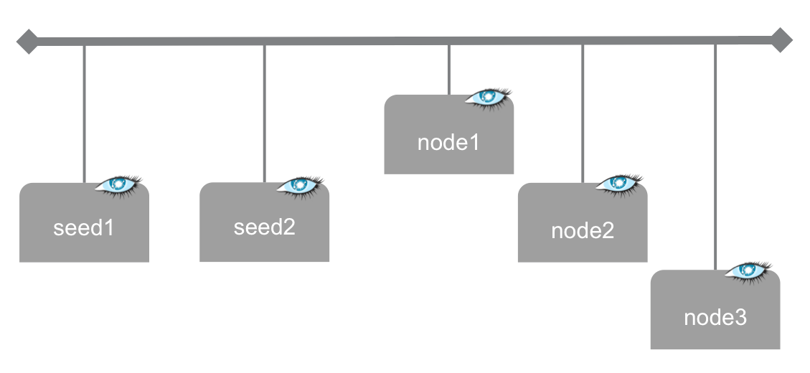

# Cassandra ring with 5 nodes

The objective here is to deploy a ring Cassandra servers, at the [Managed Cloud Platform from Dimension Data](http://cloud.dimensiondata.com/eu/en/).
This is done with [plumbery](https://developer.dimensiondata.com/display/PLUM/Plumbery) and a template that is provided below.

With this use case we prepare a ready-to-use ring of 5 Cassandra nodes. Two of them are configured
to seed the ring. The three others extend the ring, showing actual capability to scale out.

## Requirements for this use case

* Select a MCP location
* Add a Network Domain
* Add an Ethernet network
* Deploy 5 Ubuntu nodes
* Provide enough CPU, RAM and disk to each node, as defined by parameters
* Monitor nodes in the real-time dashboard provided by Dimension Data
* Assign a public IPv4 address to each node
* Add address translation to ensure end-to-end IP connectivity
* Add firewall rule to accept TCP traffic for ssh and for web consoles
* Expand system storage (LVM) with additional disk
* Update the operating system
* Synchronise node clock with NTP
* Install a new SSH key to secure remote communications
* Configure SSH to reject passwords and to prevent access from root account
* Update `etc/hosts` and `hostname` to bind network addresses to host names
* Install Java and Cassandra
* Run test commands to validate the setup

## Fittings plan

[Click here to read fittings.yaml](fittings.yaml)

## Deployment command

    $ python -m plumbery fittings.yaml deploy

This command will build fittings as per the provided plan, start the ring
and bootstrap it. Look at messages displayed by plumbery while it is
working, so you can monitor what's happening.

## Follow-up commands

At the end of the deployment, plumbery will display on screen some instructions
to help you move forward. You can ask plumbery to display this information
at any time with the following command:

    $ python -m plumbery fittings.yaml information

In this use case you can use the IPv4 assigned to the first seeding node for direct ssh
connection.

    $ ssh ubuntu@<ipv4_here>

You will have to accept the new host, and authentication will be based on
the SSH key communicated to the node by Plumbery.

Check the status of the Cassandra ring:

    $ nodetool status

To test Cassandra you can for example submit some CQL request. For this you have to use the
private IPv4 address of the node, that is shown by the `ifconfig` command:

    $ ifconfig
    $ cqlsh -e "USE testdb; SELECT * FROM employee WHERE employeeID IN (120, 125);" <IP_of_eth0_here>

## Destruction commands

Launch following command to remove all resources involved in the fittings plan:

    $ python -m plumbery fittings.yaml dispose

## Use case status

- [X] Work as expected

## See also

- [Database services with plumbery](../)
- [All plumbery fittings plans](../../)

