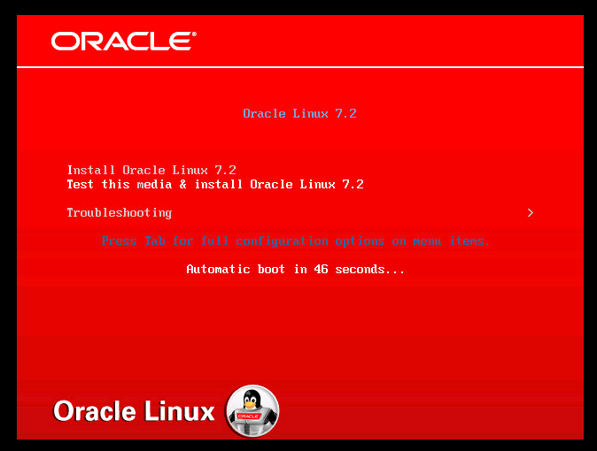
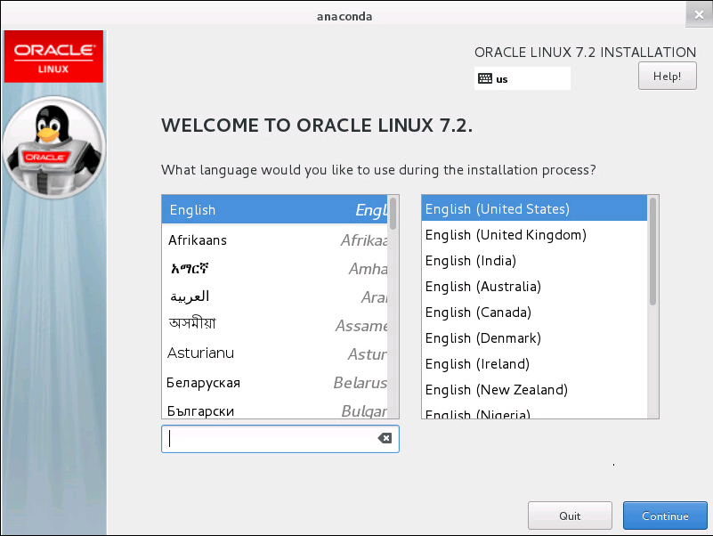

# Oracle Linux installed from ISO (experimental)

This is a special project, where Oracle Linux is deployed at the [Managed Cloud Platform from Dimension Data](http://cloud.dimensiondata.com/eu/en/).
This is done with [plumbery](https://developer.dimensiondata.com/display/PLUM/Plumbery) and a template that is provided below.

Warning: this use case is provided only for experimentation. At this point in
time Oracle Linux is not supported by Dimension Data. You are invited to consider Red Hat instead.

## Requirements for this use case

* Select a MCP location
* Add a Network Domain
* Add an Ethernet network
* Deploy a Ubuntu node
* Add a disk for the Oracle Linux installer
* Monitor this server in the real-time dashboard provided by Dimension Data
* Assign a public IPv4 address
* Add address translation to ensure end-to-end IP connectivity
* Add firewall rule to accept TCP traffic on ssh and web
* Upload the ISO of the Oracle Linux installer
* Copy the ISO to /dev/sdb
* Update the GRUB2 menu to chain to the ISO on boot
* You have to reboot the node to launch the installation

## Fittings plan

[Click here to read fittings.yaml](fittings.yaml)

## Deployment command

    $ python -m plumbery fittings.yaml deploy

This command will build fittings as per the provided plan, start the server
and bootstrap it. Look at messages displayed by plumbery while it is
working, so you can monitor what's happening.

Note: since plumbery has to upload an ISO file of about 300 MB, it is perfectly
normal that it seems stuck for a while.

## Follow-up commands

At the end of the deployment, plumbery will display on screen some instructions
to help you move forward. You can ask plumbery to display this information
at any time with the following command:

    $ python -m plumbery fittings.yaml information

For this use case, launch the console from Cloud Control and reboot the node.
This will lead to the installation menu.

When the installer is triggered the node switches to graphical mode.

This use case is purely experimental, and has the only merit to demonstrate
how a custom ISO can be booted on the MCP.

## Destruction commands

Launch following command to remove all resources involved in the fittings plan:

    $ python -m plumbery fittings.yaml dispose

## Use case status

- [X] Work as expected

## See also

- [Example configurations with plumbery](../)
- [All plumbery fittings plans](../../)

