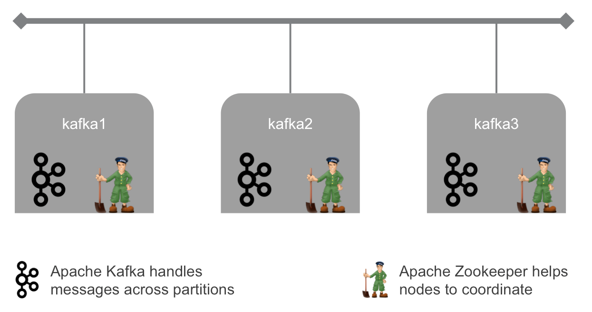

# Kafka cluster with 3 nodes

The objective here is to deploy a cluster of Kafka servers, at the [Managed Cloud Platform from Dimension Data](http://cloud.dimensiondata.com/eu/en/).
This is done with [plumbery](https://developer.dimensiondata.com/display/PLUM/Plumbery) and a template that is provided below.

[Kafka](http://kafka.apache.org/) is an open-source message broker project developed
by the Apache Software Foundation written in Scala.
The project aims to provide a unified, high-throughput, low-latency platform for
handling real-time data feeds. It is, in its essence, a "massively scalable pub/sub
message queue architected as a distributed transaction log",
making it highly valuable for enterprise infrastructures to process streaming data.
Apache Kafka was originally developed by LinkedIn, and was subsequently open sourced in early 2011.

With this use case we deploy and prepare a ready-to-use cluster of 3 Kafka nodes.
This is a highly-available cluster with a dynamic leader elected with ZooKeeper.

## Requirements for this use case

* Select a MCP location
* Add a Network Domain
* Add an Ethernet network
* Deploy 3 Ubuntu nodes
* Provide enough CPU, RAM and disk to each node, as defined by parameters
* Monitor nodes in the real-time dashboard provided by Dimension Data
* Assign a public IPv4 address to each node
* Add address translation to ensure end-to-end IP connectivity
* Add firewall rule to accept TCP traffic for ssh and for web consoles
* Expand system storage (LVM) with additional disk
* Update the operating system
* Synchronise node clock with NTP
* Install a new SSH key to secure remote communications
* Configure SSH to reject passwords and to prevent access from root account
* Update `etc/hosts` and `hostname` to bind network addresses to host names
* Install Java, ZooKeeper and Kafka
* Run test commands to validate the setup

## Fittings plan

[Click here to read fittings.yaml](fittings.yaml)

## Deployment command

    $ python -m plumbery fittings.yaml deploy

This command will build fittings as per the provided plan, start the ring
and bootstrap it. Look at messages displayed by plumbery while it is
working, so you can monitor what's happening.

## Follow-up commands

At the end of the deployment, plumbery will display on screen some instructions
to help you move forward. You can ask plumbery to display this information
at any time with the following command:

    $ python -m plumbery fittings.yaml information

In this use case you can use the IPv4 assigned to the first node for direct ssh
connection.

    $ ssh ubuntu@<ipv4_here>

You will have to accept the new host, and authentication will be based on
the SSH key communicated to the node by Plumbery.

## Destruction commands

Launch following command to remove all resources involved in the fittings plan:

    $ python -m plumbery fittings.yaml dispose

## Use case status

- [X] Work as expected

## See also

- [Logging services with plumbery](../)
- [All plumbery fittings plans](../../)

