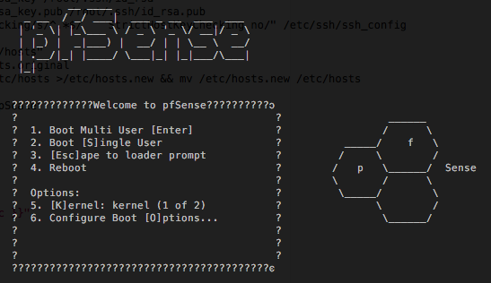

# pfSense installed from ISO (experimental)

This is a special project, where one pfSense node is deployed at the [Managed Cloud Platform from Dimension Data](http://cloud.dimensiondata.com/eu/en/).
This is done with [plumbery](https://developer.dimensiondata.com/display/PLUM/Plumbery) and a template that is provided below.

Warning: this use case is provided only for experimentations. At this point in
time pfSense is not supported by Dimension Data.

pfSense is a strong security appliance running on FreeBSD. For this experimentation we will copy the ISO installer on a secondary disk, and boot it over ssh with QEMU.

## Requirements for this use case

* Select a MCP location
* Add a Network Domain
* Add an Ethernet network
* Deploy a Ubuntu node
* Add a disk for the pfSense installer
* Add a secondary network interface to the node
* Monitor this server in the real-time dashboard provided by Dimension Data
* Assign a public IPv4 address
* Add address translation to ensure end-to-end IP connectivity
* Add firewall rule to accept TCP traffic on ssh and web
* Download the ISO of the pfSense installer
* Copy the ISO to /dev/sdb
* You have to run qemu manually to launch the installation

## Fittings plan

[Click here to read fittings.yaml](fittings.yaml)

## Deployment command

    $ python -m plumbery fittings.yaml deploy

This command will build fittings as per the provided plan, start the server
and bootstrap it. Look at messages displayed by plumbery while it is
working, so you can monitor what's happening.

## Follow-up commands

At the end of the deployment, plumbery will display on screen some instructions
to help you move forward. You can ask plumbery to display this information
at any time with the following command:

    $ python -m plumbery fittings.yaml information

In this use case you can use the IPv4 assigned to the node for direct ssh
connection.

    $ ssh ubuntu@<public_ipv4_here>

From there you will launch the installer of pfSense:

    $ sudo su
    # qemu-system-x86_64 -curses -drive file=/dev/sdb -drive file=/dev/sda -m 1G

This will load FreeBSD from the ISO, and then the main menu:

This use case is purely experimental, and has the only merit to demonstrate
how a custom ISO can be booted on the MCP.

In case you would like to play a bit with pfSense:

https://www.pfsense.org/

## Destruction commands

Launch following command to remove all resources involved in the fittings plan:

    $ python -m plumbery fittings.yaml dispose

## Use case status

- [X] Work as expected

## See also

- [Example configurations with plumbery](../)
- [All plumbery fittings plans](../../)

